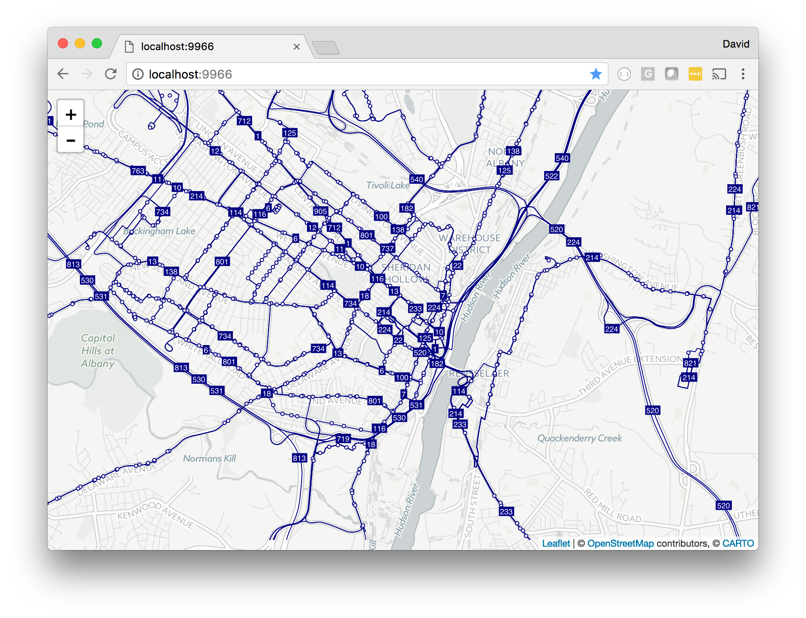

# gtfs-tiler

Generates PNG-based transit overlay tilesets for use with interactive mapping libraries, with route alignments and stops derived from one or more GTFS feeds.

## Getting Started

_Before starting: you must have an instance of [gtfs-api@v1.1.0](https://github.com/conveyal/gtfs-api/releases/tag/v1.1.0) (versions 2.0 and later will not work) running with any feeds to be rendered already loaded. Note: The default endpoint for gtfs-api is `http://localhost:4567/api/graphql`._

Clone the repo, and install [yarn](https://yarnpkg.com/en/) if necessary.

Run `yarn install` to install the dependencies.

Copy the `config-template.js` file to `config.js`. Update `config.js` for your purposes (at minimum, the gtfs-api endpoint and GTFS feed IDs must be specified).

Run `yarn generate` to render the tiles. They will be written to a directory specified in the config (by default, `./tiles`) using the Z_X_Y.png naming convention.

To view your tiles on a simple map-based demo application, run `yarn demo` and open the specified URL in a web browser.

## Notes

* The `generate` script renders both standard-resolution and high-resolution ("retina") tiles. The retina tile filenames are appended with '@2x'.

* The script only writes tiles that do not already exist on disk. To force a fresh render of previously rendered tiles, you must manually delete the existing tiles before running the script.

* The script only writes tiles that contain routes or stops; "blank" tiles are not written at all. Modern mapping libraries typically handle missing tiles cleanly, but this package also includes a utility script for creating empty tile images for any "blank" tile within the rendering bounds. To run this script, run `yarn blanks` _after_ running `yarn generate`.

* Results from the gtfs-api queries are cached to the `./cache` directory; these cached results are used on any subsequent executions of the script. To force a fresh reload of a feed from the API (i.e. if the data has changed), you must manually delete that feed's cached result.

* A simple way to generate tiles for multiple GTFS files is to place them in a single directory, set the gtfs-api directory in `application.conf` to this location, and use all of the filenames (without the `.zip` extension) as the feed IDs in gtfs-tiler's config.
